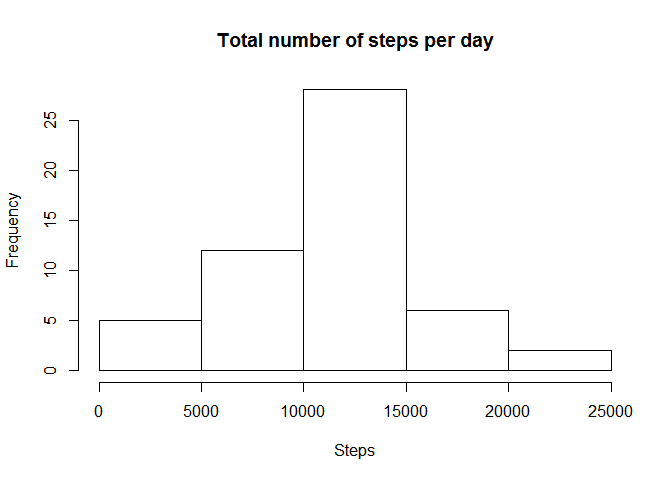
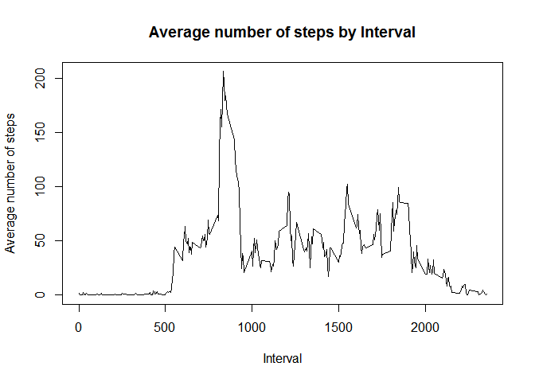
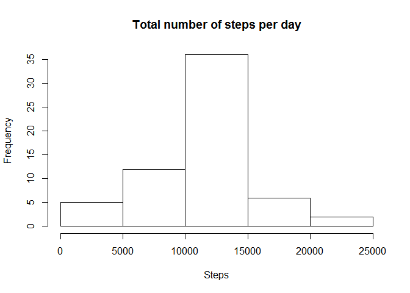

# Reproducible Research: Peer Assessment 1
Cesar Alvarez  
Sunday, August 09, 2015  

```r
library(lattice)
```
  
## Loading and preprocessing the data


```r
#Reads activity.zip from current working directory and extract activity.csv
actData <- read.csv(unz("activity.zip", "activity.csv"))
```

## What is mean total number of steps taken per day? 

### 1. Make a histogram of the total number of steps taken each day

```r
# Get total steps per day, ignore the missing values in the dataset
stepsPerDay <- aggregate(steps ~ date, data = actData, sum, na.rm=TRUE)

# Histogram of the total number of steps taken each day  
hist(aggregate(steps ~ date, data = stepsPerDay, sum, na.rm=TRUE)$steps, main="Total number of steps per day", 
     xlab="Steps")
```

 

### 2. Mean total number of steps taken per day  

```r
mean(stepsPerDay$steps, na.rm = TRUE)
```

```
## [1] 10766.19
```

### 2. Median total number of steps taken per day

```r
median(stepsPerDay$steps, na.rm = TRUE)
```

```
## [1] 10765
```

## What is the average daily activity pattern?

### 1. Time series plot (i.e. type = "l") of the 5-minute interval (x-axis) and the average number of steps taken, averaged across all days (y-axis)


```r
# Aggregate steps per interval and get average number of step
stepsPerInterval <- aggregate(steps ~ interval, data = actData, mean, na.rm=TRUE)
```


```r
# Line series plot type = l of the 5-minute interval and the average number of steps
plot(stepsPerInterval$interval, stepsPerInterval$steps, type='l', main="Average number of steps by Interval", 
     xlab="Interval", ylab="Average number of steps")
```

 

### 2. Which 5-minute interval, on average across all the days in the dataset, contains the maximum number of steps?

```r
stepsPerInterval[which.max(stepsPerInterval$steps), "interval"]
```

```
## [1] 835
```

## Imputing missing values
### 1. Calculate and report the total number of missing values in the dataset (i.e. the total number of rows with NAs)

```r
nrow(actData[is.na(actData$steps),])
```

```
## [1] 2304
```

### 2. Devise a strategy for filling in all of the missing values in the dataset. The strategy does not need to be sophisticated. 

```r
# Create tmp DS with addtional column with mean of steps by interval
tmp <- merge(actData, aggregate(steps ~ interval, data = actData, mean, na.rm=TRUE), by=c("interval"))

# then rewrite NAs in steps (steps.x) with mean by interval (steps.y) and rename column with steps
tmp[is.na(tmp$steps.x),"steps.x"] <- tmp[is.na(tmp$steps.x),"steps.y"]
names(tmp)[names(tmp) == "steps.x"] <- "steps"
```
### 3. Create a new dataset that is equal to the original dataset but with the missing data filled in.

```r
newDS <- tmp[,c("steps","date","interval")]
```

### 4. Make a histogram of the total number of steps taken each day and Calculate and report the mean and median total number of steps taken per day. 

```r
#Get total Steps from imputed data
stepsDayClean <- aggregate(steps ~ date, data = newDS, sum, na.rm=TRUE)
hist(aggregate(steps ~ date, data = stepsDayClean, sum, na.rm=TRUE)$steps, 
     main="Total number of steps per day", xlab="Steps")
```

 

### Mean total number of steps taken per day  

```r
mean(stepsDayClean$steps, na.rm = TRUE)
```

```
## [1] 10766.19
```

### Median total number of steps taken per day

```r
median(stepsDayClean$steps, na.rm = TRUE)
```

```
## [1] 10766.19
```

### Do these values differ from the estimates from the first part of the assignment?  
*A: mean did not change, median did change.*  

### What is the impact of imputing missing data on the estimates of the total daily number of steps?  
*A: small change in the median, mean is the same since no outlier were introduced, just a chenge in the distribution due to the use of mean*  
*by interval to replace NAs.*  
  
## Are there differences in activity patterns between weekdays and weekends?
### 1. Create a new factor variable in the dataset with two levels -- "weekday" and "weekend" indicating whether a given date is a weekday or weekend day.

```r
newDS$dow <- weekdays(as.Date(newDS$date, "%Y-%m-%d"))
newDS$type <- ifelse(newDS$dow %in% c("Saturday","Sunday"),"weekend","weekday")
```

### 2. Make a panel plot containing a time series plot (i.e. type = "l") of the 5-minute interval (x-axis) and the average number of steps taken, averaged across all weekday days or weekend days (y-axis).  

```r
#Average by Interval and Date Type (Weekday and Weekend)
avgType <- aggregate(steps ~ interval + type, newDS, mean)
xyplot(avgType$steps~avgType$interval|avgType$type,layout=(c(1,2)),type="l",
       xlab="Interval", ylab="Number of steps")
```

 
